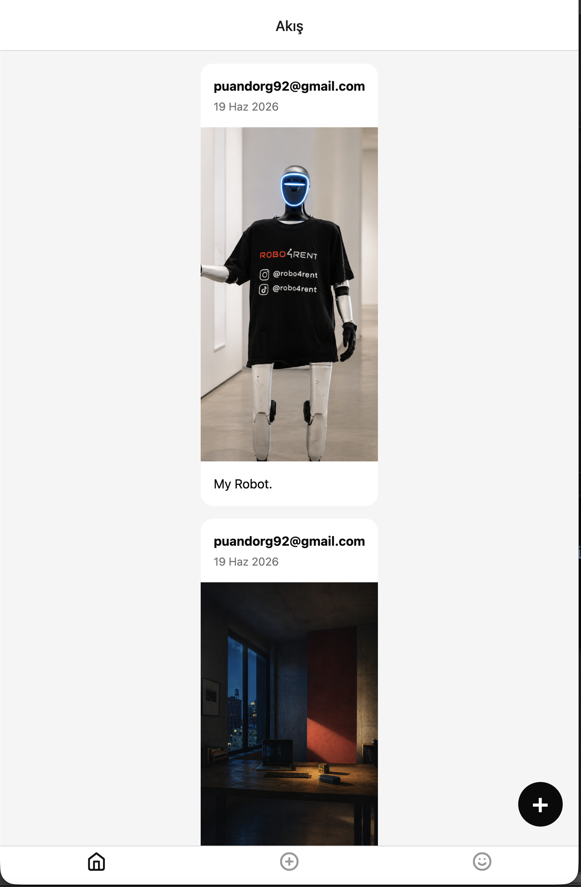
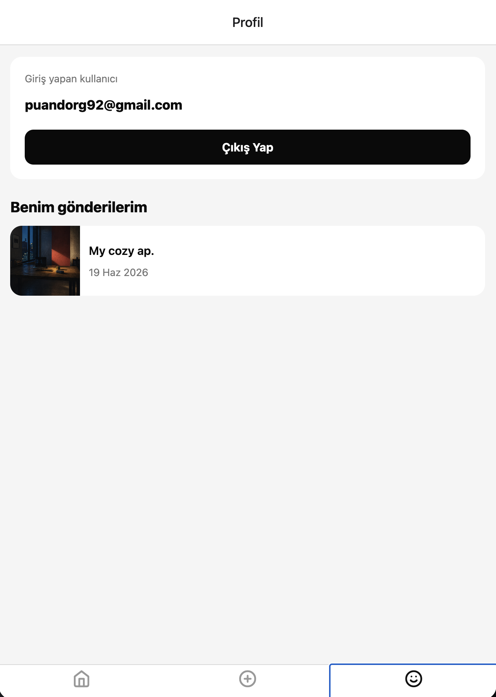

# Fotogram App

Fotogram, React Native ve Expo Router ile geliştirilmiş mini fotoğraf paylaşım uygulamasıdır. Uygulamada kullanıcılar email ve şifre ile kayıt olabilir, giriş yapabilir, galeriden fotoğraf seçerek gönderi paylaşabilir ve paylaşılan gönderileri akış ekranında görüntüleyebilir.

## Özellikler

- Email ve şifre ile kullanıcı kaydı
- Email ve şifre ile giriş
- Oturum hatırlama
- AuthContext ile global oturum yönetimi
- Korumalı route yapısı
- Firebase Storage'a fotoğraf yükleme
- Firestore'a gönderi metadata kaydı
- React Query ile gönderileri listeleme
- Feed ekranında tüm gönderileri gösterme
- Profil ekranında giriş yapan kullanıcının email bilgisini gösterme
- Profil ekranında kullanıcının kendi gönderilerini listeleme
- Çıkış yapma

## Kullanılan Teknolojiler

- React Native
- Expo
- Expo Router
- TypeScript
- Firebase Authentication
- Firebase Firestore
- Firebase Storage
- React Query
- Expo Image Picker
- NativeWind

## Proje Yapısı

```txt
app/
  _layout.tsx
  index.tsx
  signup.tsx
  (tabs)/
    _layout.tsx
    feed.tsx
    add.tsx
    profile.tsx

context/
  AuthContext.tsx

hooks/
  useAddPost.ts
  usePosts.ts

firebaseConfig.ts
```

## Firebase Yapısı

Uygulamada fotoğraflar Firebase Storage'a yüklenir. Gönderi bilgileri ise Firestore içinde `posts` koleksiyonuna kaydedilir.

Firestore `posts` koleksiyonunda kullanılan veri yapısı:

```ts
type Post = {
  id: string;
  imageUrl: string;
  caption: string;
  userId: string;
  userEmail: string;
  createdAt: Timestamp | null;
};
```

## Screenshots

### Feed Ekranı



### Gönderi Ekleme / Firebase Config Ekranı


### Profil Ekranı



## Kurulum

Projeyi klonladıktan sonra bağımlılıkları yükleyin:

```bash
bun install
```

Uygulamayı web üzerinde çalıştırmak için:

```bash
bunx expo start --web
```

Cache temizleyerek çalıştırmak için:

```bash
bunx expo start --web -c
```

## Firebase Config

Güvenlik nedeniyle `firebaseConfig.ts` içindeki Firebase proje bilgileri sansürlenmiştir. Projeyi çalıştırmak için kendi Firebase config bilgilerinizi eklemeniz gerekir.

Örnek config yapısı:

```ts
const firebaseConfig = {
  apiKey: 'YOUR_API_KEY',
  authDomain: 'YOUR_AUTH_DOMAIN',
  projectId: 'YOUR_PROJECT_ID',
  storageBucket: 'YOUR_STORAGE_BUCKET',
  messagingSenderId: 'YOUR_MESSAGING_SENDER_ID',
  appId: 'YOUR_APP_ID',
};
```

## Teslim Notu

README içerisinde feed ve profil ekranlarının screenshot'ları eklenmiştir. Firebase config bilgileri güvenlik nedeniyle sansürlenmiştir.
